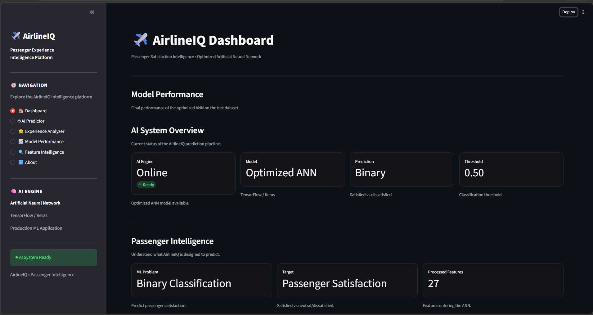
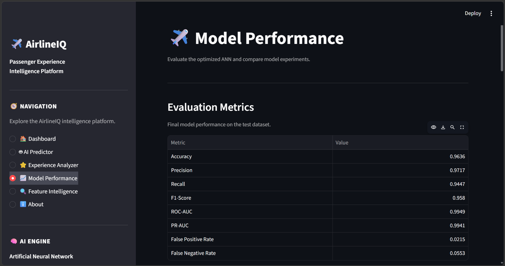
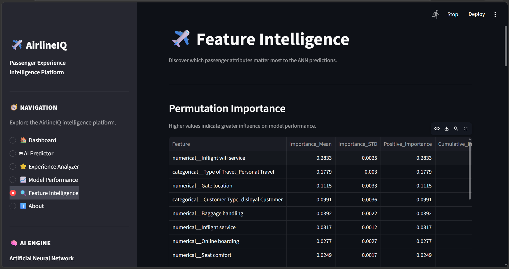

# ✈️ AirlineIQ — Airline Passenger Satisfaction Prediction

An end-to-end Machine Learning application that predicts airline passenger satisfaction using an **Artificial Neural Network (ANN)** and converts model predictions into actionable passenger-experience insights.

---

## 📌 Project Overview

AirlineIQ analyzes passenger demographics, travel characteristics, service ratings, and flight delays to predict whether a passenger is likely to be **Satisfied** or **Neutral/Dissatisfied**.

The project goes beyond model training by including:

- Exploratory Data Analysis
- Data preprocessing
- Artificial Neural Network modeling
- Model evaluation
- Hyperparameter optimization
- Feature importance analysis
- Passenger-level explanations
- Business recommendations
- Interactive Streamlit deployment

---

## 🎯 Business Problem

Airlines collect large amounts of passenger feedback and operational data, but identifying the factors that influence passenger satisfaction can be difficult.

AirlineIQ aims to answer:

> **"Will this passenger be satisfied with their flight experience?"**

The model can help airlines identify potential dissatisfaction drivers and prioritize areas such as:

- Inflight WiFi
- Online boarding
- Seat comfort
- Entertainment
- Cleanliness
- Service quality
- Flight delays

---

## 📊 Dataset

The project uses an airline passenger satisfaction dataset containing approximately **130,000 passenger records** across training and testing datasets.

### Key Features

| Category | Examples |
|---|---|
| Demographics | Gender, Age, Customer Type |
| Travel | Type of Travel, Class |
| Flight | Flight Distance |
| Services | WiFi, Boarding, Seat Comfort, Cleanliness |
| Operations | Departure Delay, Arrival Delay |
| Target | Passenger Satisfaction |

### Target Classes

- `satisfied`
- `neutral or dissatisfied`

---

## 🔎 Project Workflow

```text
Raw Passenger Data
        ↓
Data Understanding
        ↓
Exploratory Data Analysis
        ↓
Data Preprocessing
        ↓
ANN Model Development
        ↓
Model Evaluation
        ↓
Hyperparameter Optimization
        ↓
Feature Explainability
        ↓
Business Insights
        ↓
Streamlit Deployment

## 📸 Application Preview

### 🏠 AirlineIQ Dashboard



### 🤖 AI Passenger Satisfaction Predictor


### 📈 Model Performance



### 🔍 Feature Intelligence



## 🔎 Project Workflow

```text
Raw Passenger Data

        ↓

Data Understanding

        ↓

Exploratory Data Analysis

        ↓

Data Preprocessing

        ↓

ANN Model Development

        ↓

Model Evaluation

        ↓

Hyperparameter Optimization

        ↓

Feature Explainability

        ↓

Business Insights

        ↓

Streamlit Deployment